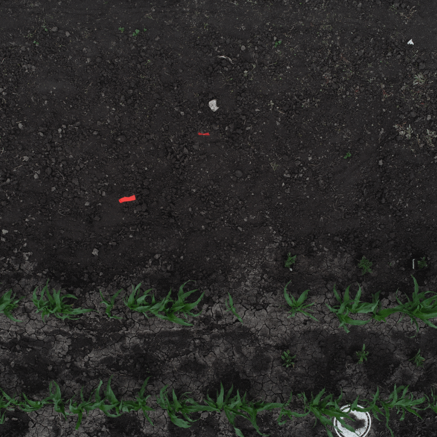
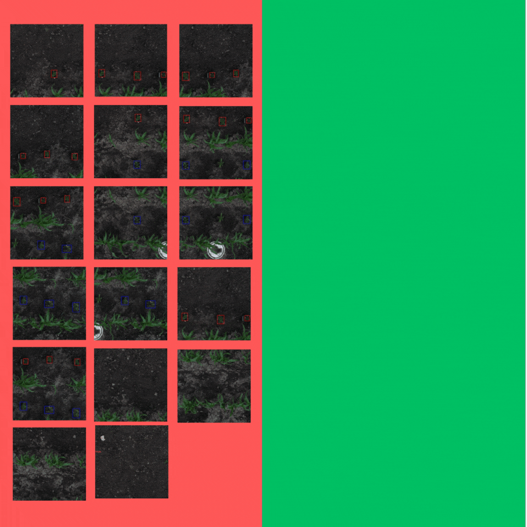

<h1>🔍 Overview</h1>

This repository provides an <b>efficient image tiling solution</b> for annotated datasets, designed to speed up training and reduce computation costs—especially for large images with sparse annotations. It supports:
    <ul>
        <li><b>Tiling large images</b> into smaller segments using configurable size and stride
        </li>
        <li><b>Annotation clustering</b> to correctly map polygons to their respective tiles
        </li>
        <li><b>Polygon visibility filtering</b> via a customizable visibility threshold
        </li>
        <li><b>Optimal tile selection</b> to maximize annotation coverage with minimal tiles</li>
        <li><b>Single or batch processing</b> through easy-to-use JSON configs
        </li>
    </ul>

<h1> Efficient Image Tiling for Annotated Datasets</h1>

In some of our projects, we faced a recurring problem: we had large images that sometimes contained only a few annotations. When we trained these images using a model—especially a segmentation model—it took a long time and consumed a significant amount of computational units on Google Colab. To optimize the process, we decided to divide the large images into smaller tiles and select only the ones that contained annotations. Our goal was to split a large image into the minimum number of tiles while ensuring that all annotations were included. This document explains our solution to this problem.

<h2>⚙️ Algorithm Steps:</h2>

<h4>The following steps were implemented to resolve the problem:</h4>

<ol>
    <li> Divide the image into tiles with a defined size and stride.</li>
    <li>Cluster the annotations according to the tiles they belong to.</li>
    <li>During each loop, choose the tile with the highest count of new annotations.</li>
</ol>

<h3>1- Divide the image into tiles with a defined size and stride:</h3>

As a first step, the image is divided into smaller tiles based on a specified size (tile_height, tile_width) and a predefined stride.

<h3>2- Cluster the annotations according to the tiles they belong to.</h3>

In the second step, the annotations are clustered and assigned each one to the corresponding image tile. This ensures that every annotation is linked to the correct region of the original image after tiling.

<ul>
    <li><b>Polygon Visibility Threshold</b>: An optional parameter allows the user to define a visibility threshold for polygons. During clustering annotations, if the visible area of a polygon within a tile is greater than or equal to the specified threshold (as a percentage of the polygon’s total area), the polygon is considered to belong to that tile. This helps ensure that only sufficiently visible polygons are associated with each tile, avoiding partial or insignificant overlaps.  
    <b>Example</b>:
    If the threshold is set to 0.3, then at least 30% of the polygon’s area must be visible in the tile for it to be included.
</li>
</ul>

<h3>3- During each loop, choose the tile with the highest count of new annotations.</h3>

In the final step, I iteratively select tiles based on the number of new (previously unselected) annotations they contain. During each loop, I choose the tile that has the highest count of new annotations. After selecting a tile, I remove it from the pool and repeat the process with the remaining tiles, always prioritizing the tile with the most new annotations in each round. This helps maximize annotation coverage efficiently.

<h2>📥 Installation</h2>

<h3>1. Clone the Repository</h3>
<pre><code>git clone https://github.com/saiwa-ai/roi-cropping.git
cd roi-cropping</code></pre>

<h3>2. Create Virtual Environment (Recommended)</h3>
<pre><code>sudo apt update
sudo apt install python3-venv
python3 -m venv roi-cropping-env
source roi-cropping-env/bin/activate</code></pre>

<h3>3. Install Dependencies</h3>
  <pre><code>pip install -r requirements.txt
</code></pre>

<h2>🚀 How to Run Inference</h2>

  This application supports two modes of inference:

<h3>🔹 1. Multiple Images</h3>

  Use this method to tile and run inference on an entire dataset of images.

<pre><code>python run_app_multiple_image.py  configs/config_multiple_images.json</code></pre>

<strong>Example config_multiple.json</strong>

<pre><code>{
  "input_annotation_path": "/path/to/input-annotation.json",
  "images_dir": "/path/to/images_dir",
  "tile_size": [1280, 1280],
  "stride": [640, 640],
  "polygon_visibility_threshold": 0.8,
  "output_dir": "/path/to/output/"
}</code></pre>

<h3>🔹 2. Single Image</h3>

  Use this method to tile and run inference on a single image.

<pre><code>python run_app_single_image.py configs/config_single_image.json</code></pre>

<strong>Example config_single.json</strong>

<pre><code>{
  "input_annotation_path": "/path/to/input-annotation.json",
  "image_path": "/path/to/image",
  "tile_size": [1280, 1280],
  "stride": [640, 640],
  "polygon_visibility_threshold": 0.8,
  "output_dir": "/path/to/output/"
}</code></pre>

<h2>📄 Parameter Description</h2>

<strong>🔔 Note:</strong> The <code>input_annotation_path</code> must point to an annotation file in <strong>COCO format</strong>.

<table border="1" cellpadding="6" cellspacing="0">
  <thead>
    <tr>
      <th>Key</th>
      <th>Type</th>
      <th>Description</th>
    </tr>
  </thead>
  <tbody>
    <tr>
      <td><code>input_annotation_path</code></td>
      <td>str</td>
      <td>Path to the input annotation JSON file (COCO format)</td>
    </tr>
    <tr>
      <td><code>images_dir</code> / <code>image_path</code></td>
      <td>str</td>
      <td>Directory of images (for multiple) or single image path</td>
    </tr>
    <tr>
      <td><code>tile_size</code></td>
      <td>list[int, int]</td>
      <td>Size of the tiles used to process each image (width x height)</td>
    </tr>
    <tr>
      <td><code>stride</code></td>
      <td>list[int, int]</td>
      <td>Stride used for tiling, controls overlap between tiles</td>
    </tr>
    <tr>
      <td><code>polygon_visibility_threshold</code></td>
      <td>float</td>
      <td>Minimum visible area ratio of a polygon to keep it</td>
    </tr>
    <tr>
      <td><code>output_dir</code></td>
      <td>str</td>
      <td>Directory where the output (images and annotations) will be saved</td>
    </tr>
  </tbody>
</table>